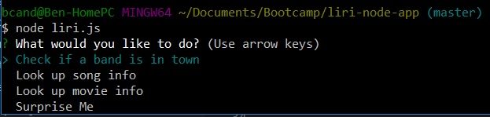
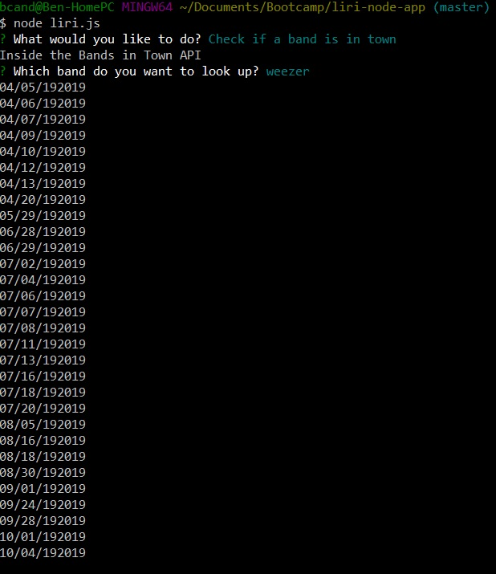
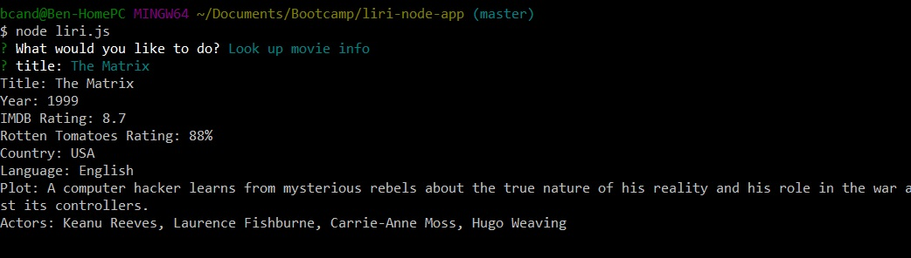
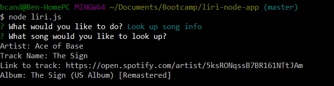
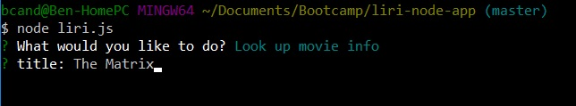
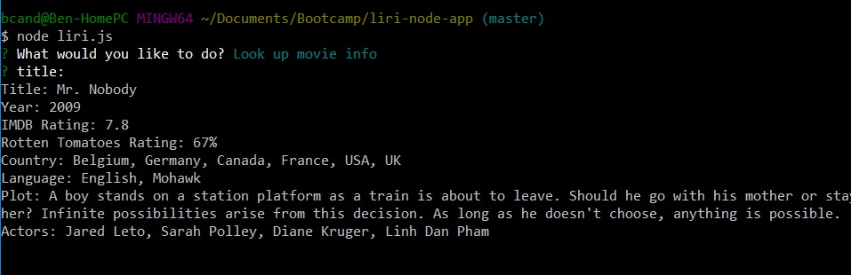
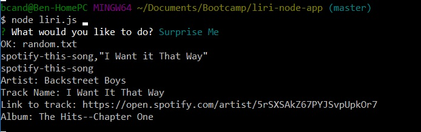

# liri-node-app
Command Line Interactive app

Liri-node-app gives you the ability to run 4 different commands through the command line interface.  Users can lookup the concert dates for their favorite band, search for song info on spotify off of their favorite song track name, lookup movie info from the omdb database, or have the app surprise them with it's own choice!

### See it in action

Step 1) Launch the app by navigating to the direcotory and running it with
```
node liri.js
```
Step 2) Select which of the 4 commands you want to execute, using the arrow keys to navigate the different options.



1. Lookup Concert Dates
    1. Select *Check if a band is in town*
    

    1. Return Concert Dates from API call to the *Bands in Town* API
    
1. Lookup Song Information off Spotify
    1. Select *Look up song info* '/n'

    
    
    1. Return Artist, Track Name, Spotify Link, and Album Name
    

    1. If not Track Name is passed in, "The Sign" by Ace of Base is returned
    
1. Look up Movie Info off of the OMDB database
    1. Select *Look up movie info*
    

    1. Return Movie Info
    

    1. If no movie is entered, info for Mr. Nobody is returned
    
1. Surprise Me - Let the app decide what to do
    1. Call the command in the random.txt file (currently a spotify call) with the data in the random.txt file
    
